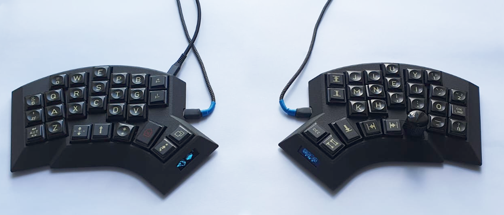
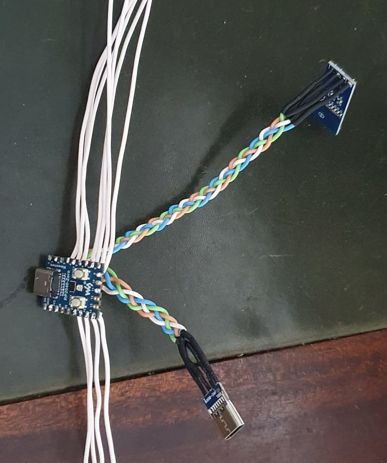
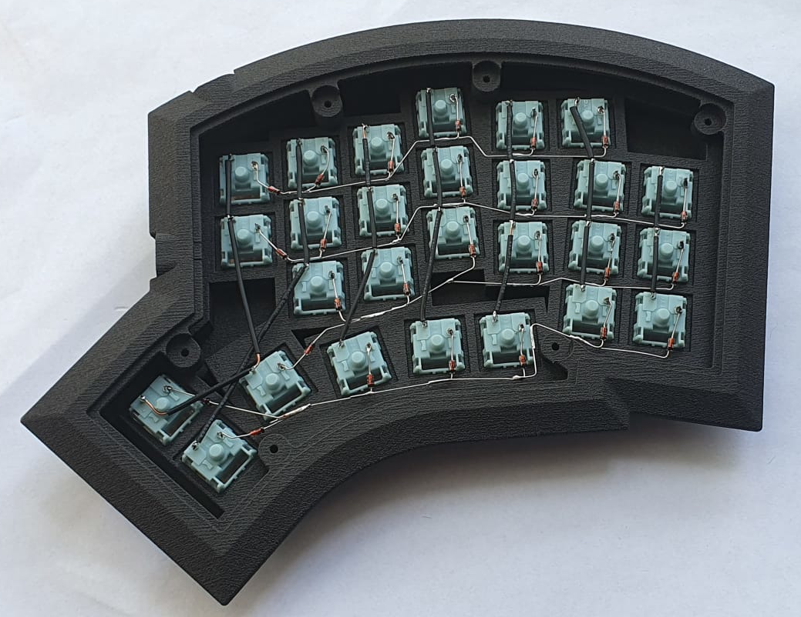
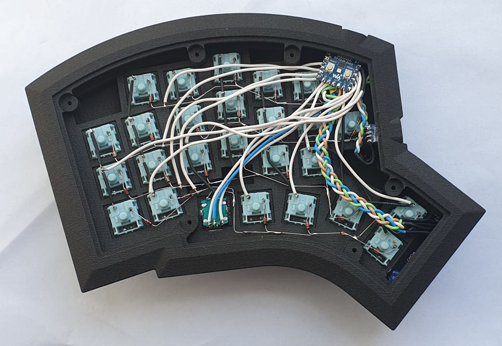
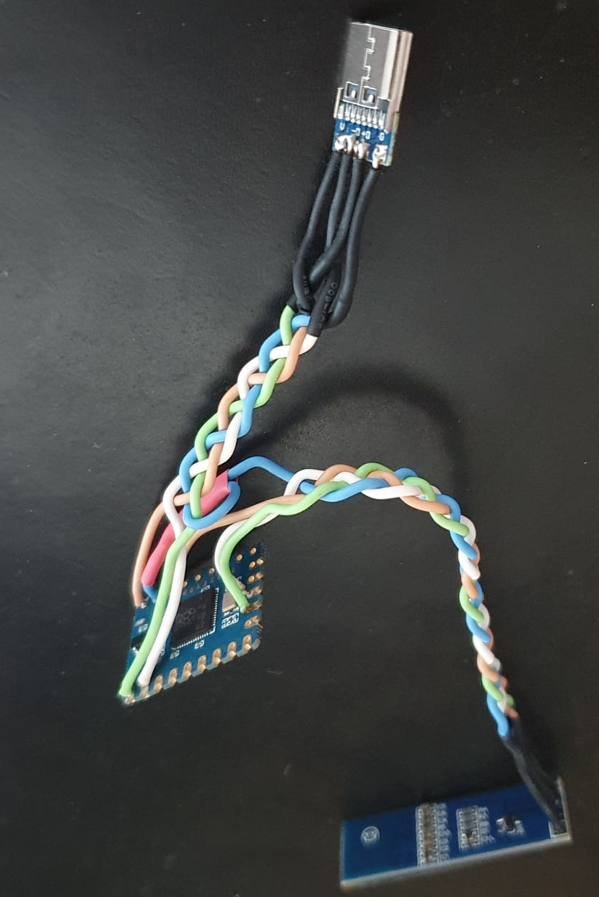
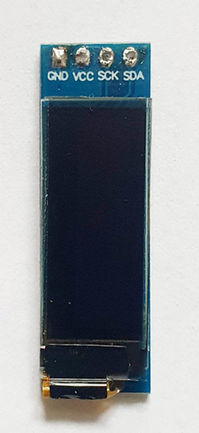

# There is still a slight issue with the area the board slots into and the area behind the USB-C connector between the two halves. Both are not dramatic but may require some manual adjustment. I will update the files as soon as possible.

## This project is not for the inexperienced builder!

### v2.0

**Note:** I am by no means a CAD engineer, so expect an absolute dog's dinner when working with the open file formats!

An ergonomic 54-key hand wired split keyboard running QMK on the RP2040 Zero MCU, living inside its 3D-printed case.



## Features

- 54-keys, split, RP2040 Zero, column stagger, ring finger (5°) and pinky (12°) splay, slightly tented case (2° toward user and 3° outward), support for one rotary encoder per half, one 128x32 OLED per half, hot-pluggable USB-C (5V) connection between halfs and a transport case

Keyboard Maintainer: [@vvhg1](https://github.com/vvhg1)  
QMK firmware files are at [https://github.com/vvhg1/fisk.git](https://github.com/vvhg1/fisk.git)

**Note:** There is a layout tester PDF in the images folder (A4 format).

## Parts Needed

### 3D-printed parts

- left and right bodies
- left and right bottoms
- 1 plug per rotary encoder
- (optional) tavel case

### Other parts

- 2 RP2040 Zero MCUs
- 2 128x32 OLED displays
- (optional) up to two rotary encoders, the plugs were designed for Alps EC11
- 54 MX compatible switches
- 52 1u keycaps and two 1.5u keycaps
- diodes
- 2 USB-C female jacks
- 12 M3\*8 self threading screws (DIN7981)
- USB-C male-male cable
- wire
- hot glue or similar for securing the MCU, OLEDs, rotary encoders and USB-C jacks

## Tools

- soldering equipment
- screw driver

**Note:** The prints need to be cleaned from any printing supports (depending on printing technology). Make sure the slot for the MCU is properly cleaned out and dry fit the MCU before installing switches.

## Switches

The switches should click right in. Depending on print quality, some hot glue might be advisable to secure them.

## Matrix Layout

Wire the matrix according to these images:
  
  


## Rotary Encoder

The rotary encoder has two pins on one side and three on the other side. The two pin side is wired as a normal key switch into the matrix. The three pin side is wired as follows:

- The middle pin is wired to GND
- The outer pins are wired according to the position defined in `config.h`:

```
// first encoder
#define ENCODERS_PAD_A \
    { GP12 }
#define ENCODERS_PAD_B \
    { GP13 }
```

Install the plug for the rotary encoder. Rounding off the bottom corners a little might help in case the plug is too oppositional. The encoder is then pushed into the plug from the bottom, secure with hot glue.

## OLED Displays

## Connection between halfs and OLEDs

See image below for wiring:



### Connection between halfs

Note that the TX and RX pins need to be swapped between the two halfs. Meaning the TX pin on the left half is connected to the RX pin on the right half and vice versa.

### Connection to the OLEDs



First unsolder the four pins on the OLED (if there are any) as they are in the way. It should look like in the image above. Then solder four wires in their place and solder the wires to the MCU according to the labels.  
Fit the display, it needs to be rotated a bit around its longitudinal axis. Check position with OLED turned on, then secure with a drop of hot glue left and right on the backside.

## Microcontroller

When fitting the MCU, make sure the USB-C is positioned correctly and a cable can be plugged in and makes contact. The MCU is secured with hot glue so it does not get pushed in when plugging in the USB-C cable and stays in position.

## Acknowledgements

This keyboard draws inspiration from many sources and would not have been possible without the works of others.
Some that deserve to be mentioned above all else are:

- the famous Kyria by Thomas Baart, [splitkb.com](https://splitkb.com)

  The aggressive column stagger, the thumb cluster and the general shape are inspired by the Kyria. The use and placement of a rotary encoder also comes from the various Kyria layouts floating around. Even the two extra index finger keys draw inspiration from here, as there was enough space in my 3D mock-up due to the different MCU placement and I just love dedicated keys for brackets.
  Would I not have gone down the route of designing a keyboard from scratch, the Kyria would have been one of the most tempting options of all the split keyboards I have come across in my research.

- the [Architeuthis dux](https://github.com/tapioki/cephalopoda/tree/main/Architeuthis%20dux) by [@tapioki](https://github.com/tapioki)

  Going one step beyond a mere column stagger and adding column splay immideately made sense to me and seemed like the next logical step. The even more extreme pinky stagger was a welcome encouragement in the design process of the physical layout and the column splay turned out to feel very natural.

- the [Lotus58 case design](https://www.thingiverse.com/thing:4768218) by Matt James, a welcome breather from the usual blocky, vertical wall case designs.

**Note:** In case I have forgotten to mention someone or a reference to an author's work, please let me know and I will happily correct it.

## License

Copyright © 2022 @vvhg1

These designs are distributed under the Creative Commons Attribution-NonCommercial-ShareAlike 4.0 International Public License
