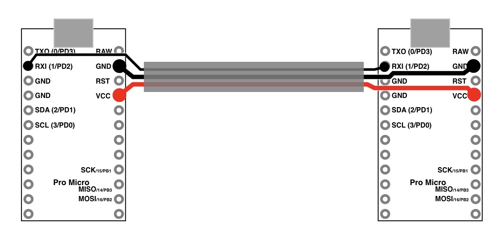
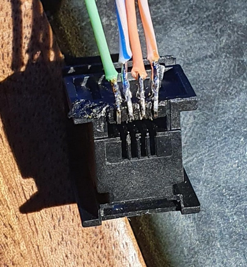
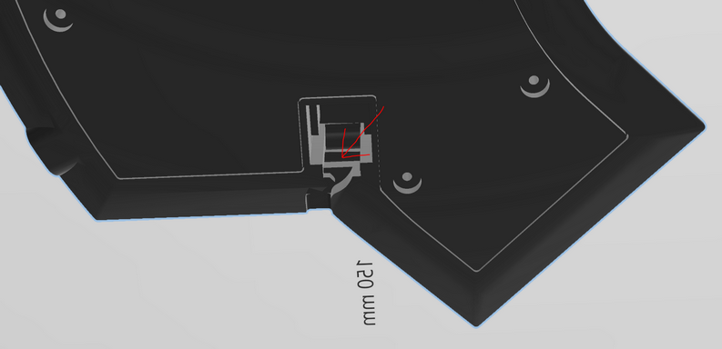
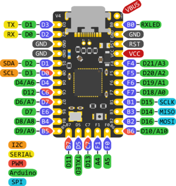
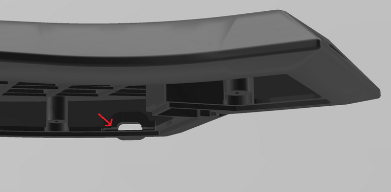

# WARNING, this is a pre-release! This means that the files as well as the guide are essentially untested and there is no guaranty that everything will smoothly assemble as intended (or as a worst case, at all!)    
## This project is not for the inexperienced builder! 
## I will not provide any tech support or any other kind of support!
### v0.1
**Note:** I am by no means a CAD engineer, so expect an absolute dog's dinner when working with the open file formats!    

An ergonomic 54-key hand wired split keyboard running QMK on the Elite-C microcontroller, living inside its 3D-printed case.


## Features
- 54-keys, split, Elite-C microcontroller, column stagger, ring finger (5°) and pinky (12°) splay, slightly tented case (2° toward user and 3° outward), support for one rotary encoder per half, one 128x32 OLED per half, hot-pluggable RJ10 connection between halfs and a transport case

Keyboard Maintainer: [@vvhg1](https://github.com/vvhg1)   
QMK firmware files are at [https://github.com/vvhg1/fisk.git](https://github.com/vvhg1/fisk.git) 

**Note:** There is a layout tester PDF in the images folder (A4 format).
## Parts
### 3D-printed parts
- left and right bodies
- left and right bottoms
- 1 plug per rotary encoder
- (optional) tavel case
### Other parts needed
- 2 Elite-C microcontrollers
- 2 128x32 OLED displays
- (optional) up to two rotary encoders, the plugs were designed for Alps EC11
- 54 MX compatible switches
- 52 1u keycaps and two 1.5u keycaps
- diodes
- 2 RJ22 (aka RJ9) connectors of this type: TE Connectivity Part# 1-338084-3
- 12 M3 self threading screws (up to 5.6mm head dia, up to 2.1mm head height, up to 8mm length (c10mm total length))
- cable with RJ22 4/4  (aka RJ9) connectors
- wire
## Tools
- soldering equipment
- hot glue
- screw driver

## Matrix Layout
Wire the matrix according to these schematics:
    

## Rotary Encoder
The rotary encoder has two pins on one side and three on the other side. The two pin side is wired as a normal key switch into the matrix. The three pin side is wired as follows:
- The middle pin is wired to GND
- The outer pins are wired according to the position defined in `config.h`:
```
// first encoder
#define ENCODERS_PAD_A \
    { C6 }
#define ENCODERS_PAD_B \
    { B5 }
```
## OLED Displays
    
First unsolder the four pins on the OLED as they are in the way. It should look like in the image above. Then solder four wires in their place and solder the wires to the MCU according to the labels.    
Fit the display, it needs to be rotated a bit around its longitudinal axis. Check position with OLED turned on, then secure with hot glue.    

## Serial connection between halfs
  
Image source: [QMK](https://github.com/qmk/qmk_firmware/blob/master/docs/feature_split_keyboard.md)   
    
     
    


Wire the RJ females jack and insulate the pins (keep it slender for the next step):   
     

Then thread the cables through here:    
    

...and push the jack into its slot, if it is too loose, set it with some hot glue.    

**Note:** Make sure that the wires do not cross over, which will depend on the cable used, as the RJ male connectors are transparent, it is easy to see which colour is on which pin.    

## Microcontroller
    
Image source: [deskthority.net/wiki/Elite-C](https://deskthority.net/wiki/Elite-C)     

     

When soldering the wires to the microcontroller, make sure the solder on the backside is as flat as possible as there is no space to spare inside the case.   
The microcontroller is mounted into the case with the flat side facing away from the switches. Secure it with a blob of hot glue at the back of the board as a backstop so it can't get pushed in when plugging in the USB.   
     

Slot for the MCU:   
    


## Acknowledgements
This keyboard draws inspiration from many sources and would not have been possible without the works of others.
Some that deserve to be mentioned above all else are:
- the famous Kyria by Thomas Baart, [splitkb.com](https://splitkb.com)

    The aggressive column stagger, the thumb cluster and the general shape are heavily influenced by the Kyria. The use and placement of a rotary encoder also comes from the various Kyria layouts floating around. Even the two extra index finger keys draw inspiration from here, as there was enough space in my 3D mock-up due to the different MCU placement and I just love dedicated keys for brackets.
    Would I not have gone down the route of designing a keyboard from scratch, the Kyria would have been one of the most tempting options of all the split keyboards I have come across in my research.
    
- the [Architeuthis dux](https://github.com/tapioki/cephalopoda/tree/main/Architeuthis%20dux) by [@tapioki](https://github.com/tapioki)

    Going one step beyond a mere column stagger and adding column splay immedietely made sense to me and seemed like the next logical step. The even more extreme pinky stagger was a welcome encouragement in the design process of the physical layout (apparently my pinkies are rather short) and the column splay turned out to feel very natural.
    
- the [Lotus58 case design](https://www.thingiverse.com/thing:4768218) by Matt James.

   
**Note:** In case I have forgotten to mention someone or a reference to an author's work, please let me know and I will happily correct it.

## License
Copyright © 2022 @vvhg1

These designs are distributed under the Creative Commons Attribution-NonCommercial-ShareAlike 4.0 International Public License 